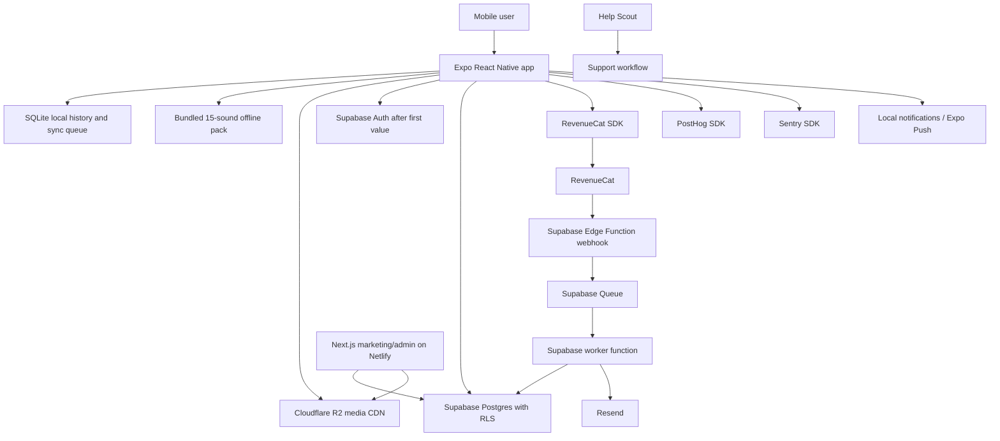

# Tech Stack Decision Record

Last reviewed: 2026-05-18

Related docs:

- Use [Technical Foundation](technical-foundation.md) for module boundaries and draft data model.
- Use [MVP Scope and Roadmap](../product/mvp-scope-and-roadmap.md) for implementation priority.
- Use [Feature Deep Specs](../product/feature-deep-specs.md) for product behavior behind the stack decisions.
- Use [Assumptions, Risks, and Open Questions](../research/assumptions-risks-open-questions.md) for launch decisions that remain outside the stack.

## Purpose

This document is the final starting technical architecture for the Sleep + Breathwork app after reviewing the complete product bible.

The goal is to make the app feel instant, work at night under weak connectivity, support English, Spanish, and Portuguese from the beginning, and avoid early architecture decisions that would break under large user growth.

No stack can guarantee users never see lag. The decision is to keep the critical sleep and breathwork experience local-first, serve media globally, run slow work asynchronously, and monitor the real app from the first public build.

## Product Constraints Driving The Stack

- Every feature must be demonstrable in 15 seconds and feel useful and calming within 60 seconds.
- First session must work without account creation, paywall, backend dependency, or notification permission.
- The breathing pacer is the visual center of the product and must animate smoothly for full sessions.
- Rescue Me must start immediately with no network calls and no setup.
- The 16 base sound loops are bundled in the app and work fully offline after licensing and loop QA clear.
- Sleep stories and premium/large audio are progressively downloaded from a global media CDN.
- The app launches in English, Spanish, and Portuguese.
- The app sends at most one habit notification per day by default.
- Billing, cancellation, renewal reminders, and support must be designed to avoid competitor-style trust failures.

## Decision Summary

| Area | Decision |
| --- | --- |
| Mobile app | Expo React Native with TypeScript and Expo Router |
| Native build/release | EAS Build, EAS Submit, EAS Update |
| Repository | pnpm workspace with Turborepo |
| UI system | Tailwind CSS v4, NativeWind v5, `react-native-css`, CSS-enabled primitives, Expo Font |
| Icons | Lucide React Native |
| Animation | React Native Reanimated plus React Native SVG |
| Audio playback | `expo-audio` with background playback enabled and device proof before broad UI work |
| Haptics | `expo-haptics` for active-session cues |
| Brightness/dimming | App-level dimming plus `expo-brightness` where platform permissions allow |
| Local database | `expo-sqlite` with versioned local migrations |
| Secure local storage | `expo-secure-store` |
| State and server cache | Zustand plus TanStack Query |
| Localization | `expo-localization`, i18next, react-i18next, ICU plural/interpolation support |
| Backend/database | Supabase Auth after first value, Postgres, RLS, Edge Functions, Queues, Cron |
| Production DB region | US East / North Virginia for v1 |
| Media storage/CDN | Cloudflare R2 for remote audio, stories, artwork, and share assets |
| Subscriptions | RevenueCat with one launch entitlement: `premium` |
| Analytics and flags | PostHog with explicit events and feature flags |
| Error/performance monitoring | Sentry |
| Notifications | Local notifications and Expo Push through `expo-notifications` |
| Transactional email | Resend |
| Support inbox | Help Scout for public launch |
| Marketing/admin web | Next.js on Netlify |
| Testing | Jest, React Native Testing Library, Maestro, Supabase local Docker tests, k6 |
| CI | GitHub Actions plus EAS workflows |

## System Architecture



The user-facing sleep flow must not wait on Supabase, RevenueCat, PostHog, Sentry, R2, or Expo Push. The app starts with local session definitions, bundled sounds, local SQLite, and local install identity. The network improves sync, personalization, subscriptions, content updates, and observability, but it is not required for the user to start breathing.

## Mobile App

Use Expo React Native with TypeScript, Expo Router, development builds, and EAS.

Reasons:

- One production codebase for iOS and Android.
- Expo development builds give native capability without managing full native projects by hand.
- Expo Router maps naturally to the five-tab product bible navigation.
- EAS Build, Submit, and Update reduce release friction and make staged fixes practical.
- Current Expo SDKs cover the required native surfaces: audio, haptics, brightness, localization, notifications, SQLite, secure storage, fonts, and config plugins.

Rules:

- Use development builds, not Expo Go, for real testing.
- Treat EAS Update as JavaScript-only delivery. Native changes, subscription contract changes, and schema-dependent changes require a binary release or strict runtime-version gating.
- The first production build must include Sentry source map upload.

## Repository Layout

Use a pnpm workspace with Turborepo from the beginning:

```text
apps/
  mobile/
  web/
packages/
  config/
  domain/
  i18n/
  ui-tokens/
  validation/
supabase/
  migrations/
  functions/
  seed/
docs/
```

Responsibilities:

- `apps/mobile`: Expo React Native app.
- `apps/web`: Next.js marketing, legal, support, and later admin.
- `packages/domain`: shared domain constants, technique definitions, streak rules, insight rule types.
- `packages/i18n`: locale resources and shared translation typing.
- `packages/ui-tokens`: product bible colors, spacing, typography, radius, and motion tokens.
- `packages/validation`: shared Zod schemas for webhook payloads, sync payloads, and admin forms.
- `supabase`: database migrations, Edge Functions, seeds, and local config.

## UI And Design System

Use Tailwind CSS v4 and NativeWind v5 through `react-native-css` for the whole Expo UI. Product design tokens remain the source of truth, exposed through the Tailwind theme and CSS variables, and screens should compose small CSS-enabled primitives rather than ad hoc styling objects.

Required design implementation:

- Colors, spacing, radius, elevation, and motion tokens come from [Design System](../design/design-system.md) and are expressed as Tailwind theme values/classes.
- Nunito and Inter are loaded with Expo Font and bundled with the app.
- Lucide React Native is the icon set.
- Navigation labels always include text, not icon-only tabs.
- App surfaces use the Midnight Indigo dark theme as the default night experience.
- Morning mode uses the Dawn light palette where appropriate.
- Mobile UI implementation uses the project-local `expo-tailwind-setup` skill for Tailwind, NativeWind, `react-native-css`, CSS-enabled wrappers, and HTML/Tailwind handoff migration guidance.

Do not add a heavy cross-platform UI framework at project start. The product bible is custom, animation-heavy, and audio-centered; a generic component library would add surface area without owning the product's core interaction quality.

## Animation And Visual Pacer

Use React Native Reanimated and React Native SVG.

Implementation source:

- [Animation Source Alignment](../engineering/animation-source-alignment.md)
- [Animation Engineering Index](../engineering/animation-engineering-index.md)
- [Animation Implementation Review Notes](../engineering/animation-implementation-review-notes.md)
- [Animation UI/UX Deep Spec Source](../engineering/animation-ui-ux-deep-spec-source.md)
- [Motion, Animation, And Haptics](../design/motion-animation-haptics.md)
- [Breathing Orb Implementation Spec](../design/breathing-orb-implementation-spec.md)

Implementation rules:

- The breath phase timer is the source of truth.
- Reanimated drives scale, opacity, progress rings, and phase text transitions.
- React Native SVG draws progress rings and circular mixer controls.
- The breathing orb uses deterministic phase state, not decorative loops.
- Motion uses slow, rhythmic `ease-in-out` behavior aligned with the product bible.
- The 4-7-8 pacer must run for 5 minutes on real iOS and Android devices without visible dropped-frame bursts before we build the rest of the feature surface.

## Audio

Use `expo-audio` and prove it on real devices before broad UI implementation.

Required behavior:

- Background playback continues when the device locks.
- Lock-screen/background configuration is enabled through the `expo-audio` config plugin.
- The app uses `setAudioModeAsync` with background playback enabled for sleep sessions.
- Two to three simultaneous ambient layers can play with independent volume control.
- Sleep timer fade-out runs for two minutes.
- The player releases keep-awake or power-management locks when playback ends.
- Audio interruption handling covers calls, alarms, headphones, Bluetooth changes, and app backgrounding.
- Base sounds play from bundled local files without network access.
- Sleep stories use progressive 3-minute chunks from R2.

Audio files:

- Source masters are stored outside the app as archival WAV files.
- App-bundled loops use AAC-LC `.m4a`, normalized and cut for seamless looping.
- The launch bundle includes all 16 base sounds from the accepted Sound Mixer catalog.
- Remote story and premium audio objects live in Cloudflare R2.

Screen-off guidance:

- Audio cues are the guaranteed screen-off guidance layer.
- Haptics are required while the app is active and screen-on.
- Screen-lock haptic behavior is a device proof gate. If iOS or Android prevents reliable haptics while locked, the product guarantee becomes audio-first for locked-screen sessions rather than pretending haptics can bypass platform limits.

## Haptics

Use `expo-haptics`.

Rules:

- Inhale transition uses light impact.
- Exhale transition uses soft or lighter-feeling feedback where available.
- Star ratings and mood selections use light haptic feedback.
- Users can disable haptics.
- Haptics never replace audio cues for accessibility or locked-screen reliability.

## Brightness And Bedtime Dimming

Use app-level dimming for all users and `expo-brightness` where platform permissions allow.

Rules:

- Never block the session on a brightness permission.
- If system brightness control is unavailable, dim the app UI to the fully dark sleep surface.
- Ask for brightness-related permission only after the user has experienced value.
- Restore brightness state responsibly after the session ends or the app returns to normal mode.
- Release any keep-awake or power-management lock after sleep timer playback ends so the OS can dim and lock naturally.

## Local Data And Offline Sync

Use `expo-sqlite` with a small versioned migration runner.

SQLite stores:

- Local install identity.
- Onboarding response.
- Breath session history.
- Wind-down run history.
- Morning check-ins.
- Saved sound mixes.
- Streak cache.
- Downloaded media catalog state.
- Sync queue.

Use `expo-secure-store` for sensitive tokens and secure local values.

Rules:

- First breath and Rescue Me save locally before any backend call.
- Morning check-in confirms locally immediately and syncs later.
- Sync operations are idempotent.
- Server IDs are mapped back to local records after sync.
- Failed sync never blocks breathwork, audio, haptics, or local history.

## Auth And Account Model

Use local install identity first. Create Supabase anonymous auth only after first value or as a non-blocking background task.

Flow:

1. App launches with generated `local_install_id`.
2. User completes first session with no account.
3. Session is saved in local SQLite.
4. App attempts anonymous Supabase auth in the background.
5. Sync maps local records to `user_id` after auth succeeds.
6. User is later invited to link Apple, Google, or email when there is clear value.

Account-link moments:

- Progress tracking after first session.
- Subscription restore.
- Cross-device sync.
- Data export or deletion.

Rules:

- No Supabase auth call can block onboarding or first session.
- No email/social account prompt appears before first value.
- No authorization decision uses user-editable metadata.
- Session migration from anonymous to linked identity must preserve all local records.

## Localization

Use `expo-localization`, i18next, react-i18next, and ICU-style plural/interpolation support.

Launch locales:

- English: `en`.
- Spanish: `es`.
- Portuguese for Brazil: `pt-BR`.

Rules:

- No user-facing strings are hardcoded in feature components.
- Dates, times, subscription copy, notification copy, and accessibility labels are localized.
- Technique names can remain recognizable, but explanatory copy is localized.
- Audio catalog metadata is locale-aware.
- Sleep stories are represented as locale-specific content records, not translated text attached to one global story.
- Locale files live in `packages/i18n`.
- The app supports runtime language selection in Settings in addition to device locale detection.

## Client State And Networking

Use Zustand and TanStack Query.

Responsibilities:

- Zustand owns active session state: breath phase, timers, selected sound layers, screen dimming state, temporary onboarding state, and active Rescue Me state.
- TanStack Query owns server state: profile, catalog metadata, entitlement mirror, synced history, and insight cards.
- SQLite owns durable local records and sync queue.

Rules:

- TanStack Query retries do not replace the explicit sync queue.
- Feature flags are cached so a failed network request does not break app launch.
- Server state never becomes the source of truth for an in-progress breath or audio session.

## Backend And Database

Use Supabase for Auth, Postgres, Row Level Security, Edge Functions, Queues, Cron, and local development.

Production region:

- Use US East / North Virginia for v1 production.
- Worldwide UX is protected by local-first flows and Cloudflare media delivery.
- Revisit database region only after real user distribution and latency data justify a change.

Rules:

- Every user-owned table has `user_id`.
- Every exposed table has RLS enabled.
- RLS policies are backed by indexes on filtered columns.
- Public catalog data is separate from user-owned data.
- Large histories require pagination or date bounds.
- Subscription state is mirrored from RevenueCat, not invented locally.
- Payment and sync event tables are append-only.
- Long-running or retryable work goes through queues.
- Service-role keys never ship in the mobile app or public web client.

Initial tables:

| Table | Purpose |
| --- | --- |
| profiles | User preferences, locale, bedtime target, anonymous/linked account state |
| local_install_links | Mapping from local install IDs to Supabase users |
| breathing_techniques | Technique metadata and timing |
| breathing_technique_translations | Localized names and explanatory copy |
| sound_assets | R2 media metadata, category, duration, loop info, entitlement |
| sound_asset_translations | Localized sound names/descriptions |
| sound_mixes | Saved user mixes |
| breath_sessions | Breathwork session records |
| wind_down_runs | Full evening ritual run records |
| morning_check_ins | Sleep rating and mood/energy tag |
| streak_states | Current streak, pause state, comeback state, ghost mode |
| subscription_states | RevenueCat entitlement mirror |
| revenuecat_events | Append-only webhook event log |
| sync_events | Sync audit/debug event log |
| insight_cards | Generated sleep pattern cards |
| challenges | Challenge definitions |
| challenge_translations | Localized challenge text |
| challenge_progress | User challenge progress |
| notification_preferences | Bedtime, wake time, locale, opt-in state |

## Backend Compute

Use Supabase Edge Functions, Supabase Queues, and Supabase Cron.

Edge Functions handle:

- RevenueCat webhook ingestion.
- Entitlement refresh.
- Resend email calls.
- Insight generation triggers.
- Admin-only catalog updates.
- R2 signed URL generation if private media is required.

Queues handle:

- Webhook side effects after quick acknowledgement.
- Email jobs.
- Insight generation.
- Retryable sync repair.
- Media metadata processing.

Cron handles:

- Daily streak reconciliation.
- Trial and renewal reminder checks.
- Queue health checks.
- Weekly summaries.

Rules:

- Webhooks respond quickly, store raw event payloads, and process side effects asynchronously.
- Queue workers are idempotent.
- No user-facing bedtime action depends on a queue completing.

## Media Storage And CDN

Use Cloudflare R2 for remote media from day one.

R2 stores:

- Sleep stories.
- Premium or large ambient sounds.
- Artwork.
- Share-card assets.
- Future localized audio packs.

Supabase stores metadata only.

Bundled media:

- All 16 launch base sounds are included in the app install.
- Bundled sounds must be loop-tested before release.
- The app never streams the default sleep sound needed for first value.

Rules:

- R2 object keys include content type, locale when applicable, version, and stable content ID.
- Media metadata in Supabase includes checksum, duration, loop point notes, locale, entitlement, and current status.
- The app verifies cached media versions against metadata but keeps playable cached media if the network is unavailable.

## Payments And Entitlements

Use RevenueCat.

Launch products:

- Free tier.
- Monthly subscription.
- Annual subscription.
- Lifetime purchase if approved for launch positioning.

Launch entitlement:

- `premium`.

Rules:

- First session has no paywall.
- Entitlement checks never interrupt active breathwork or audio.
- Paywall configuration can be fetched remotely, but the app has a safe local fallback.
- RevenueCat webhooks are authenticated, stored, idempotent, and queued for side effects.
- Supabase mirrors entitlement state for server checks and support lookup.
- Renewal reminders are sent through Resend before annual renewal where platform rules allow.

## Analytics And Feature Flags

Use PostHog.

Rules:

- Track explicit events only.
- No broad autocapture on sensitive bedtime, sleep, billing, or support screens.
- Session replay is off by default and requires privacy review before use.
- Feature flags are used for staged rollout of onboarding, paywall copy, insight cards, and audio experiments.
- Analytics opt-out exists in Settings.

Initial events:

- `onboarding_started`
- `onboarding_completed`
- `first_breath_started`
- `first_breath_completed`
- `rescue_me_started`
- `rescue_me_completed`
- `wind_down_started`
- `wind_down_completed`
- `audio_started`
- `audio_failed`
- `sound_mix_saved`
- `morning_check_in_completed`
- `streak_paused`
- `comeback_completed`
- `insight_card_viewed`
- `notification_permission_prompted`
- `notification_permission_accepted`
- `paywall_viewed`
- `trial_started`
- `subscription_started`
- `sync_failed`

## Error And Performance Monitoring

Use Sentry.

Required setup:

- Sentry React Native SDK in the mobile app.
- Release and environment tags.
- EAS Build source map upload.
- EAS Update source map upload.
- Route/session context where privacy allows.
- Sampling for performance traces.

Critical alerts:

- App startup crash.
- Breath session crash.
- Rescue Me crash.
- Audio playback error rate.
- Background audio stop/failure.
- Sync queue growth.
- RevenueCat purchase error.
- RevenueCat webhook failure.
- Edge Function error spike.
- Database slow query spike.

## Notifications

Use `expo-notifications`, local scheduled notifications, and Expo Push.

Rules:

- Ask permission on Day 3 after at least two completed sessions.
- Default habit notification limit is one per day.
- Default product pushes are limited to Evening Anchor, Streak Milestone, and one-time 3-day Re-engagement.
- Morning check-in and insight-ready prompts are in-app by default unless the user explicitly enables extra reminders later.
- Wind-down reminders are scheduled locally when possible.
- Subscription lifecycle notifications can use Expo Push or email where appropriate.
- Server-side push sending must throttle below Expo Push limits.
- Notification copy is localized.
- Notification content never includes sensitive sleep details.
- Marketing push opt-in is separate from product reminders.

## Email And Support

Use Resend for transactional email.

Transactional email covers:

- Account linking.
- Trial reminders.
- Annual renewal reminders.
- Billing issue notices.
- Data export/delete confirmation.
- Support follow-up.

Use Help Scout for public launch support.

Support requirements:

- Support can look up a user by Supabase user ID, local install ID, RevenueCat customer ID, or email.
- Billing issues are linked to RevenueCat state.
- Support macros exist in English, Spanish, and Portuguese.
- Support surfaces must not expose raw health-adjacent notes or private sleep data by default.

## Health Integrations

Do not include Apple Health or Android Health Connect in MVP.

Architecture requirements:

- Keep the data model ready for later imported sleep data.
- Do not request health permissions in onboarding.
- Do not make health data a dependency for insight cards.
- Revisit HealthKit first after the manual check-in loop proves retention.

## Web, Admin, And Legal

Use Next.js on Netlify for `apps/web`.

Web app responsibilities:

- Marketing site.
- App Store and Google Play links.
- Privacy policy.
- Terms.
- Support pages.
- Press kit.
- Deep-link campaign pages.
- Admin surface before public launch.

Admin responsibilities:

- Audio catalog metadata.
- Story metadata.
- Sound entitlement/free/premium status.
- Challenge definitions.
- Localized copy review.
- Support lookup.
- Feature flag links.

Rules:

- Admin access uses Supabase Auth with an allowlisted admin role.
- Admin privileged operations go through Edge Functions or restricted SQL functions.
- No direct service-role key appears in browser code.

## Security And Privacy

Minimum requirements:

- RLS on all exposed Supabase tables.
- No service-role key in mobile or public web.
- No microphone sleep tracking.
- No health permissions in MVP.
- No sensitive data in push notifications.
- No broad session replay.
- Analytics opt-out.
- Data export and deletion before public launch.
- Separate development, staging, and production projects.
- Short-lived signed URLs for private R2 media if premium media is not public.
- App Store and Google Play privacy labels reviewed before submission.

## Environments

Use three environments:

- Development: local Supabase through Docker, local Expo development build, local R2-compatible mock or development bucket.
- Staging: separate Supabase project, R2 staging bucket, RevenueCat sandbox, PostHog staging, Sentry staging, Resend test mode.
- Production: separate Supabase project, R2 production bucket, live RevenueCat, production PostHog, production Sentry, production Resend, app store builds.

No production data is used in local development.

## Performance Budgets

| Area | Budget |
| --- | --- |
| Splash to usable onboarding | Less than 2 seconds on a recent mid-range phone |
| Tap Start to first breath phase | Less than 500 ms |
| Rescue Me tap to visible orb | Less than 300 ms |
| Cached audio start | Less than 500 ms |
| Streamed story first chunk start | Less than 2 seconds on normal LTE/Wi-Fi |
| Breath pacer animation | No visible dropped-frame bursts during a 5-minute session |
| Sleep timer power release | Keep-awake or power-management lock released when playback ends |
| Morning check-in save | Local confirmation immediately |
| Sync queue while online | Normal items synced within 5 minutes |
| Lightweight Edge Function p95 | Under 500 ms after cold start is excluded |
| Paywall entitlement check | Never blocks active breathwork or audio |

Device testing is required. Simulator testing does not prove audio, lock-screen, haptics, notifications, or app startup performance.

## Reliability And Operations

Operational requirements:

- Sentry release health checked for every production release.
- PostHog funnels for onboarding, first breath, wind-down, morning check-in, paywall, and retention.
- Supabase slow-query review before every public release.
- RevenueCat webhook delivery monitoring.
- Queue depth monitoring.
- R2 media availability checks.
- Backup and restore drill before public launch.
- Incident runbooks for audio failure, bad EAS update, payment outage, database degradation, and push notification failure.

## Testing And CI

Use GitHub Actions and EAS workflows.

Required checks:

- TypeScript.
- ESLint.
- Unit tests with Jest.
- Component tests with React Native Testing Library.
- Local SQLite migration tests.
- Supabase migration validation.
- Supabase local integration tests with Docker.
- Edge Function tests.
- RevenueCat webhook fixture tests.
- i18n missing-key check for English, Spanish, and Portuguese.
- Maestro smoke tests on development or preview builds.
- k6 backend load tests for webhook, sync, catalog, and entitlement paths.
- Manual real-device audio checklist for iOS and Android.
- Sentry source map upload verification.

Integration tests that require Supabase local services must run with Docker access.

## First Technical Proofs

Complete these before building broad app screens:

1. Expo development build with Reanimated, SVG, Audio, Haptics, Brightness, SQLite, Localization, Sentry, and PostHog installed.
2. Nunito, Inter, design tokens, and the Midnight Indigo palette render in a dev screen.
3. 4-7-8 pacer runs smoothly for 5 minutes on real iOS and Android devices.
4. Rescue Me starts from a cold app state without a network call.
5. Breath audio cues work with the screen locked.
6. Haptic behavior is measured on real devices for active and locked states.
7. Ambient audio plays in the background with a 2-minute timer fade-out.
8. Sleep timer playback releases keep-awake or power-management locks when audio ends.
9. Three-layer sound mix works with independent volume.
10. All 16 bundled sounds play offline and loop without audible clicks.
11. Local session record persists before any Supabase auth requirement.
12. Anonymous Supabase auth is created after first value or retried in the background.
13. Synced Supabase user can create and read only their own check-ins.
14. R2 story chunk downloads and resumes correctly.
15. RevenueCat entitlement can be read and mirrored through a webhook.
16. Local notifications are scheduled only after permission is granted.
17. English, Spanish, and Portuguese strings render with no missing keys.
18. Sentry captures a test error with release and source map.

## Deliberately Not In The Starting Stack

- NestJS API.
- Microservices.
- Kubernetes.
- Custom native audio module before the `expo-audio` proof.
- Native watch app.
- HealthKit or Health Connect in MVP.
- AI chatbot or therapy engine.
- Real-time social/community features.
- Broad session replay.
- Push-marketing journey platform.

## Sources Checked

- Expo Audio: https://docs.expo.dev/versions/latest/sdk/audio/
- Expo Localization: https://docs.expo.dev/versions/latest/sdk/localization/
- Expo Push Notifications FAQ: https://docs.expo.dev/push-notifications/faq/
- Expo Sentry guide: https://docs.expo.dev/guides/using-sentry/
- React i18next: https://react.i18next.com/
- Turborepo workspaces: https://turborepo.com/docs/guides/workspaces
- Netlify Next.js overview: https://docs.netlify.com/frameworks/next-js/overview/
- Cloudflare R2 pricing: https://developers.cloudflare.com/r2/pricing/
- Supabase Edge Functions: https://supabase.com/docs/guides/functions
- Supabase RLS: https://supabase.com/docs/guides/auth/auth-deep-dive/auth-row-level-security
- Supabase anonymous auth: https://supabase.com/docs/guides/auth/auth-anonymous
- Supabase Queues: https://supabase.com/docs/guides/queues
- Supabase Cron: https://supabase.com/docs/guides/cron
- RevenueCat webhooks: https://www.revenuecat.com/docs/integrations/webhooks
- PostHog React Native: https://posthog.com/docs/libraries/react-native
- Help Scout shared inbox: https://docs.helpscout.com/article/1581-what-is-shared-inbox
- Maestro React Native: https://docs.maestro.dev/platform-support/react-native
- React Native Testing Library: https://callstack.github.io/react-native-testing-library/docs/start/quick-start
